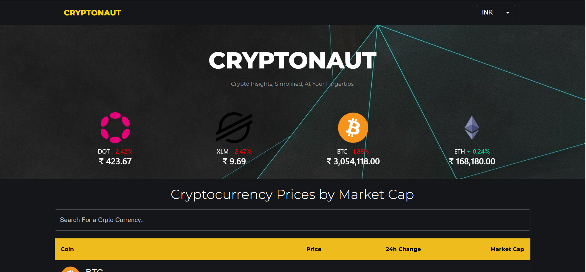
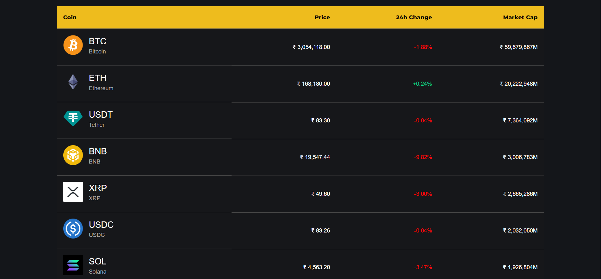
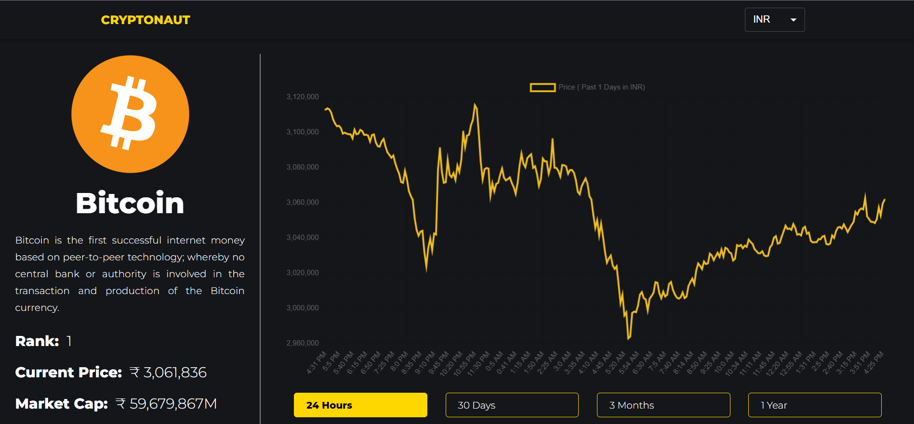

# Cryptonaut

Cryptonaut is a web application built with React that allows users to explore details of various cryptocurrencies using the CoinGecko API.

## Table of Contents

- [Features](#features)
- [Demo](#demo)
- [Getting Started](#getting-started)
  - [Prerequisites](#prerequisites)
  - [Installation](#installation)
- [Usage](#usage)
- [Technologies Used](#technologies-used)
- [Contributing](#contributing)

## Features

- View detailed information about cryptocurrencies.
- Search for specific cryptocurrencies.
- Interactive charts to visualize cryptocurrency data.

## Demo

Live Site - [https://cryptonaut.onrender.com/](https://cryptonaut.onrender.com/)

- HOMEPAGE:
  

- ALL COINS:
  

- INDIVIDUAL COINS:
  

## Getting Started

### Prerequisites

- Node.js and npm installed on your machine.

### Installation

1. Clone the repository:

   ```bash
   git clone https://github.com/ArchitKandu/Cryptonaut.git
   ```

2. Navigate to the project directory:

   ```bash
   cd cryptonaut
   ```

3. Install dependencies:

   ```bash
   npm install
   ```

## Usage

1. Start the development server:

   ```bash
   npm start
   ```

2. Open your browser and visit [http://localhost:3000](http://localhost:3000) to view the application.

## Technologies Used

- React
- CoinGecko API
- Material-UI

## Contributing

Contributions are welcome! Follow these steps:

1. Fork the repository.
2. Create a new branch: `git checkout -b feature-name`
3. Make your changes and commit them: `git commit -m 'Add some feature'`
4. Push to the branch: `git push origin feature-name`
5. Open a pull request.
